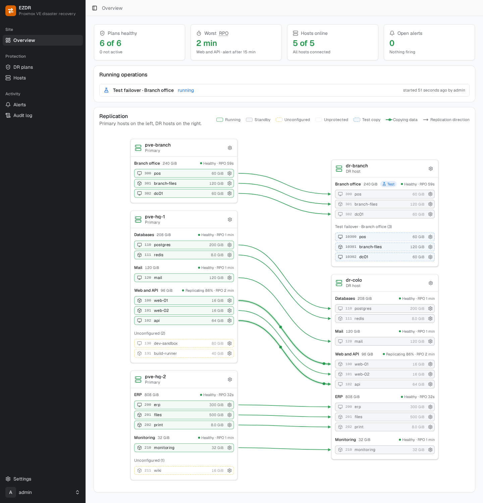
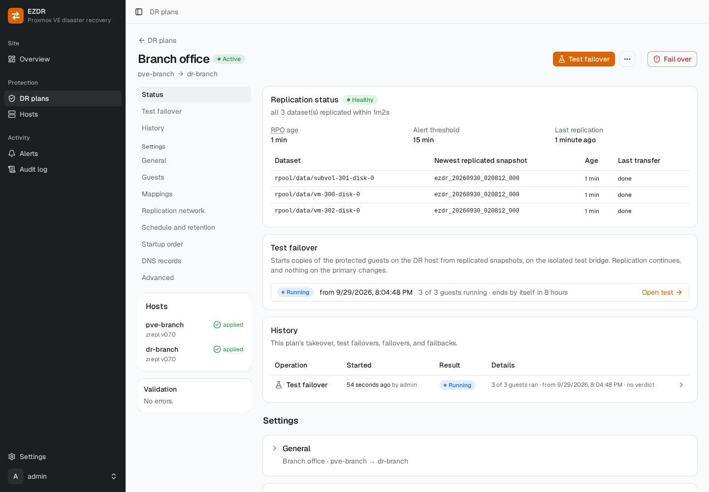
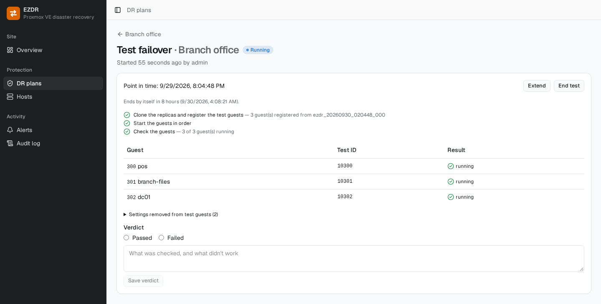
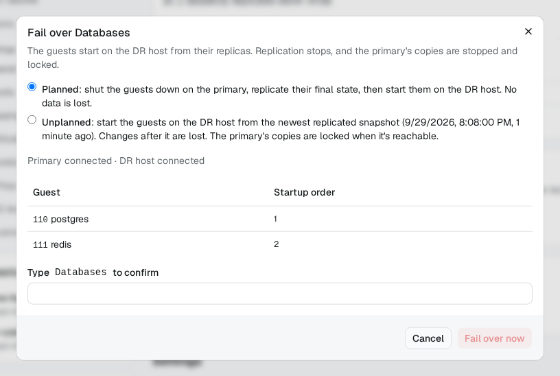

# EZDR (Easy Disaster Recovery)

**Site-to-site disaster recovery for Proxmox VE with ZFS.** EZDR keeps a warm
copy of your VMs and containers on a Proxmox VE host at a second site, lets
you prove it works with test failovers, and fails over (and back) with a few
clicks, including switching your public DNS records.

It's self-hosted and open source: a small agent on each Proxmox VE host, and a
web portal you run on a VPS outside the sites it protects.

<picture>
  <source media="(prefers-color-scheme: dark)" srcset="docs/images/overview-dark.png">
  
</picture>

## Who it's for

EZDR is for you if you run Proxmox VE with ZFS and want a second site to take
over when the first one goes down, for example:

- a small business with a server in the office and one in a colocation
  facility or a second office;
- a homelab with a standby host at a friend's or family member's house;
- an MSP protecting a customer's host with a DR host in its own rack.

If both hosts sit in the same building and you want automatic failover
between them, a Proxmox VE cluster with high availability is a better fit (see
[the comparison below](#ezdr-or-proxmox-ve-storage-replication)).

## What it does

- **Inventory:** see the guests, storage, and networks on each host, and
  whether they're ready for replication.
- **DR plans:** choose the guests to protect, map storage and networks between
  the sites, and set the snapshot interval (1 minute to 24 hours), retention,
  startup order, and DNS records.
- **Replication:** ZFS snapshots are replicated incrementally with
  [zrepl](https://zrepl.github.io/), over a network you already have between
  the sites or over a WireGuard tunnel that EZDR sets up. An existing
  hand-written zrepl setup can be taken over without starting from scratch.
- **Monitoring and alerts:** replication health and recovery point age per
  plan, with email and webhook alerts when replication falls behind or a host
  stops reporting.
- **Test failover:** start copies of your guests on the DR host from any
  retained snapshot, on an isolated network, while replication keeps running.
  Results are kept as a history of your DR tests.
- **Failover:** planned (a final sync first, so nothing is lost), unplanned
  (the primary is gone), or break-glass (from the DR host's command line when
  the portal is unreachable too). Cloudflare DNS records are switched as part
  of the failover.
- **Failback:** return to the primary with an incremental transfer, then
  resume replication.

Failover is always started by a person; EZDR never fails over on its own.

## Screenshots

A plan's page shows its replication status, test failovers, and history:

<picture>
  <source media="(prefers-color-scheme: dark)" srcset="docs/images/plan-dark.png">
  
</picture>

A test failover starts copies of the guests on the DR host, on an isolated
network, and records the result:

<picture>
  <source media="(prefers-color-scheme: dark)" srcset="docs/images/test-failover-dark.png">
  
</picture>

Failing over asks for a planned or unplanned failover and shows the order the
guests will start in:

<picture>
  <source media="(prefers-color-scheme: dark)" srcset="docs/images/failover-dark.png">
  
</picture>

## EZDR or Proxmox VE storage replication?

Proxmox VE has built-in
[storage replication](https://pve.proxmox.com/wiki/Storage_Replication),
which also uses ZFS snapshots. It's designed for nodes in the **same
cluster**, usually in the same building, where it keeps a recent copy for high
availability and fast migration. EZDR is designed for recovering at a
**different site**.

| | Proxmox VE storage replication | EZDR |
| --- | --- | --- |
| Hosts | Nodes of one cluster. Clustering needs a low-latency link (Proxmox recommends under 5 ms) and quorum, so stretching one cluster across sites is fragile. | Separate, standalone hosts at different sites, connected over the internet or a VPN. |
| History | Keeps only the latest replicated state, so deleted files, corruption, or ransomware reach the copy at the next sync. | Keeps a history of snapshots on the DR host (by default, every snapshot for 24 hours, daily for 14 days, and weekly for 8 weeks), so you can recover from before the problem. |
| If the primary is compromised | Cluster nodes trust each other fully, so an attacker with root on one node can reach the others and their copies. | The DR host pulls from the primary, so the primary has no way to delete or change the DR copy. |
| Storage and networks | The same storage name on both nodes. | Storage and networks are mapped between the sites per plan. |
| Testing | No built-in way to test a recovery. | Test failovers on isolated clones, with a history of results. |
| Failover | Automatic with HA, or by moving the guest's configuration by hand. | Guided planned, unplanned, and break-glass failovers with startup order and DNS switching, and failback to the primary. |

The two work well together: a cluster with HA protects against losing one
server, and EZDR protects against losing the whole site. EZDR also doesn't
replace backups: keep using [Proxmox Backup Server](https://www.proxmox.com/en/proxmox-backup-server)
or similar for long-term, off-site copies.

## How it works

```text
                     ┌──────────────────────────┐
                     │  Portal (VPS, off-site)  │
                     │  web UI · API · database │
                     └────────────┬─────────────┘
                   control plane (WireGuard, started by the hosts)
                 ┌────────────────┴────────────────┐
       ┌─────────┴─────────┐             ┌─────────┴─────────┐
       │   Primary host    │  zrepl over │      DR host      │
       │ Proxmox VE + ZFS  │────────────►│ Proxmox VE + ZFS  │
       │   EZDR client     │   TLS (pull)│   EZDR client     │
       └───────────────────┘             └───────────────────┘
```

- The portal is the control plane: it stores plans and status and tells the
  hosts what to do. Hosts connect to it; they need no inbound ports for it.
- Replication data goes directly between the hosts and never passes through
  the portal.
- The DR host keeps what it needs to fail over locally, so a failover works
  even if the portal is down.

See the [architecture document](docs/architecture.md) for details, including
the security model.

## Requirements

- Two Proxmox VE 9 hosts with ZFS storage, one at each site. Standalone hosts
  are supported today; Proxmox VE clusters are on the
  [roadmap](docs/architecture.md#9-roadmap).
- A small server outside both sites for the portal (1 vCPU, 1–2 GB of memory,
  Docker with the Compose plugin).
- A network path between the sites: an existing site-to-site VPN, or one
  forwarded UDP port at one site for EZDR's tunnel.
- For DNS failover: DNS hosted on Cloudflare (more providers may follow).

## Status

EZDR is young: version 0.x. Every workflow above works end to end and has
been tested on Proxmox VE 9 lab hosts, including taking over an existing
hand-written zrepl setup, test failovers, planned, unplanned, and
break-glass failovers, and incremental failback. Try it on a lab first, and
run a test failover before relying on it.

## Quick start

1. Deploy the portal with Docker Compose on a server outside the sites it
   protects ([deployment guide](docs/deployment.md)).
2. Open the portal, create the administrator with the setup code from the
   portal's log, and set up two-factor authentication.
3. Select **Add host** and run the command it shows on each Proxmox VE host.
4. Create a DR plan, activate it, and run a test failover once the first
   replication finishes.

Releases are signed, and their files and images carry build provenance; see
[Verify a release](docs/deployment.md#verify-a-release).

## Documentation

- [Deploying EZDR](docs/deployment.md): install the portal, enroll hosts,
  back up, upgrade, and uninstall.
- [Architecture](docs/architecture.md): components, data flows, and security
  model.
- [Documentation index](docs/README.md), including the design document for
  each feature.

## Getting help and contributing

- Questions and ideas: [Discussions](https://github.com/jlbyh2o/ezdr/discussions).
- Bugs and feature requests: [Issues](https://github.com/jlbyh2o/ezdr/issues).
- Security vulnerabilities: report them privately as described in
  [SECURITY.md](SECURITY.md).
- Contributing: see [CONTRIBUTING.md](CONTRIBUTING.md) for development
  setup, commit conventions, and the DCO sign-off requirement. Everyone
  taking part is expected to follow the [code of conduct](CODE_OF_CONDUCT.md).

## License

EZDR is licensed under the [GNU Affero General Public License v3.0](LICENSE).
